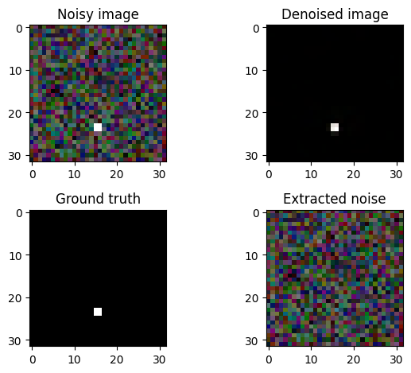

# ConvNeXt-V2-UNet
A U-Net architecture built with a modified ConvNeXt-V2 block, designed for enhanced flexibility by allowing different input and output channel configurations. This library currently focuses on standard U-Net applications; sparse versions suitable for autoencoding tasks are not yet implemented. 



## Installation instructions

You can install this package locally using pip.

1. Clone the Repository:
First, get a copy of the project:
Bash

``` bash
git clone https://github.com/rymuelle/ConvNeXt-V2-UNet.git
cd ConvNeXt-V2-UNet
```

2. Install with Pip:
For Development (Editable Mode):
``` bash
pip install -e .
```

For Standard Local Installation:
``` bash
pip install .
```
## Example:

```examples/simple_denoising.ipynb``` contains a simple demonstration of the unet for denoising. 

## Licensing

This project is licensed under the MIT free use license. 


## Acknowledgments

This code is adapted from work by Meta:

Woo, S., Debnath, S., Hu, R., Chen, X., Liu, Z., Kweon, I. S., & Xie, S. (2023). ConvNeXt V2: Co-designing and Scaling ConvNets with Masked Autoencoders. arXiv preprint arXiv:2301.00808.

https://github.com/facebookresearch/ConvNeXt-V2


## Setting up MLflow Locally to Run the Model

1.  **Install MLflow:**
    If you don't have MLflow installed, you can install it using pip:
    ```bash
    pip install mlflow
    ```
    Alternatively, if you are using Poetry or UV:
    ```bash
    poetry add mlflow
    # or
    uv pip install mlflow
    ```

2.  **Start the MLflow Tracking Server:**
    To store and view your experiment runs, open your terminal and run:
    ```bash
    mlflow ui --port 5001
    ```
    This will start a local server, typically at `http://localhost:5001`. Open this URL in your browser to view the MLflow UI.

3.  **Configure Your Model Code to Use MLflow:**
    In your Python script where you train your model, you'll need to add MLflow logging. Here's a basic example:

    ```python
    import mlflow
    # Import the MLflow module for your specific ML framework (e.g., sklearn, pytorch, tensorflow)
    # import mlflow.sklearn
    # import mlflow.pytorch
    # import mlflow.tensorflow

    # Start an MLflow run. You can also set an experiment name.
    # mlflow.set_experiment("My Model Experiment")
    with mlflow.start_run():
        # Log parameters (hyperparameters, configuration, etc.)
        mlflow.log_param("param_name_1", "value1")
        mlflow.log_param("param_name_2", 0.05)

        # ... your model training code goes here ...
        # model = train_your_model_function()
        # metrics_dict = evaluate_model_function(model)

        # Log metrics (performance indicators like accuracy, loss, F1-score)
        # mlflow.log_metric("accuracy", metrics_dict["accuracy"])
        # mlflow.log_metric("loss", metrics_dict["loss"])

        # Log your trained model
        # For scikit-learn:
        # mlflow.sklearn.log_model(model, "model_artifact_name")
        # For PyTorch:
        # mlflow.pytorch.log_model(model, "model_artifact_name")
        # For TensorFlow/Keras:
        # mlflow.tensorflow.log_model(model, "model_artifact_name")

        # Log other artifacts (e.g., plots, data files, configuration files)
        # mlflow.log_artifact("path/to/your/output_file.txt")
        # mlflow.log_artifact("path/to/your/plot.png")
    ```

4.  **Run Your Model Training Script:**
    Execute your Python script. MLflow will automatically log the parameters, metrics, and artifacts to the tracking server (by default, it creates an `mlruns` directory in your current working directory if `mlflow ui` is not running or if a remote tracking URI is not set).

5.  **View Experiments in MLflow UI:**
    Go back to the MLflow UI in your browser (e.g., `http://localhost:5001`). You should see your experiment and its runs, along with all the logged information.
